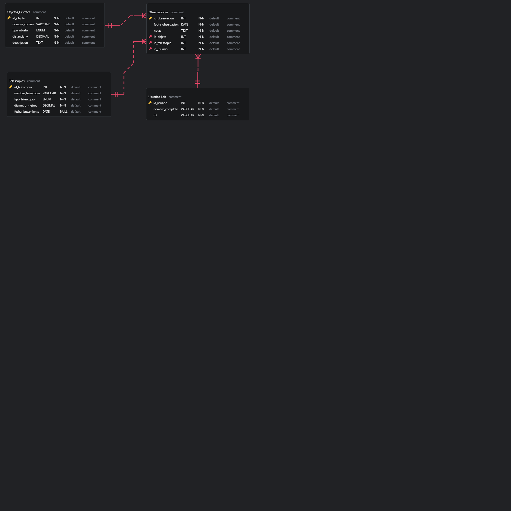

# 5. Documentación del Modelo de Datos para el Catálogo Astronómico

## Introducción

Este documento detalla el proceso de diseño y elaboración del modelo de datos para el sistema de gestión de un catálogo astronómico. El modelado de datos es el primer y más crucial paso en el desarrollo de una base de datos, ya que define la estructura lógica, las entidades, los atributos y las relaciones que gobernarán el almacenamiento y la manipulación de la información.

El objetivo de este modelo es resolver un problema de baja complejidad: crear un sistema centralizado para registrar objetos celestes y las observaciones asociadas a ellos, asegurando la integridad y consistencia de los datos.

---

### Proceso de Elaboración del Modelo Entidad-Relación (ER)

Para representar el modelo de datos de manera clara y estandarizada, se utilizó un **diagrama Entidad-Relación (ER)**. Este proceso se dividió en los siguientes pasos:

#### 1. Identificación de Entidades

Las entidades son los "sustantivos" o conceptos principales del sistema. Se identificaron cuatro entidades clave para satisfacer los requerimientos del proyecto:

-   **`Objetos_Celestes`**: Representa los sujetos de estudio. Almacena información intrínseca y canónica de cada cuerpo astronómico (estrellas, galaxias, nebulosas, etc.).
-   **`Telescopios`**: Representa los instrumentos utilizados para las observaciones. Centraliza los datos de cada telescopio para evitar redundancia.
-   **`Usuarios_lab`**: Representa al personal (observadores, científicos) que realiza las observaciones, permitiendo la trazabilidad de los datos.
-   **`Observaciones`**: Es la entidad central o "transaccional" del modelo. Representa un evento único en el tiempo en el que un usuario observa un objeto celeste con un telescopio específico.

#### 2. Definición de Atributos

Para cada entidad, se definieron sus atributos (o campos), especificando la información que se almacenaría. A cada atributo se le asignó una **clave primaria (PK)** para garantizar la unicidad de cada registro.

-   **Ejemplo:** Para la entidad `Objetos_Celestes`, se definieron atributos como `id_objeto` (PK), `nombre_comun`, `tipo_objeto` y `distancia_ly`.

#### 3. Establecimiento de Relaciones

El paso final fue definir cómo se conectan estas entidades entre sí. El modelo se diseñó alrededor de la entidad `Observaciones`, que actúa como el nexo que une a todas las demás:

-   **`Objetos_Celestes` y `Observaciones`**: Se estableció una relación de **Uno a Muchos (1:N)**. Un objeto celeste puede tener muchas observaciones, pero una observación específica corresponde a un solo objeto.
-   **`Telescopios` y `Observaciones`**: Se estableció una relación de **Uno a Muchos (1:N)**. Un telescopio puede ser utilizado en muchas observaciones, pero una observación se realiza con un único telescopio.
-   **`Usuarios_lab` y `Observaciones`**: Se estableció una relación de **Uno a Muchos (1:N)**. Un usuario puede realizar muchas observaciones, pero una observación es realizada por un único usuario.

Para implementar estas relaciones, la entidad `Observaciones` contiene **claves foráneas (FK)** (`id_objeto`, `id_telescopio`, `id_usuario`) que apuntan a las claves primarias de las otras tres tablas.

### Diagrama Entidad-Relación Final

El siguiente diagrama visualiza el modelo de datos completo, mostrando las entidades, sus atributos principales y las relaciones establecidas entre ellas.

### Conclusión

La elaboración de este modelo de datos antes de la implementación en SQL fue un paso fundamental para asegurar que la estructura de la base de datos fuera lógica, normalizada y escalable. El diagrama ER sirvió como un plano guía que facilitó la creación de las tablas y la definición de las restricciones, resultando en un sistema robusto y coherente para la gestión de datos astronómicos.